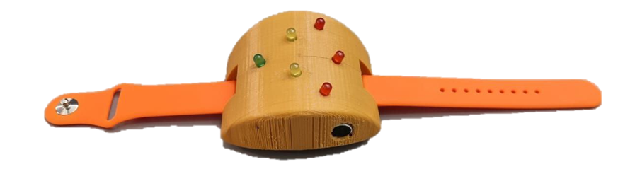

# Сурдобраслет на Arduino

## Цель и актуальность

**Сурдобраслет** — это устройство для людей с нарушениями слуха, которое преобразует звуковые сигналы окружающей среды в тактильные (вибрация) и визуальные (светодиоды) оповещения.

### Актуальность проекта

По данным ВОЗ, более 5% населения мира страдает от потери слуха. Люди с нарушениями слуха не могут своевременно реагировать на важные звуковые сигналы: плач ребёнка, дверной звонок, сигнал тревоги, приближающийся транспорт и т.д. Данный проект предлагает доступное решение на базе Arduino, которое помогает слабослышащим людям лучше ориентироваться в звуковой среде.

### Цель проекта

- Создание носимого устройства для мониторинга звукового окружения
- Преобразование звуковых сигналов в вибрацию и цветовую индикацию
- Предоставление пользователям возможности ощущать громкость звука через тактильные сигналы

---

## Как работает сурдобраслет

### Принцип действия

Устройство анализирует уровень входного звукового сигнала через электретный микрофон и в зависимости от громкости активирует:

| Уровень звука | Напряжение (мВ) | Вибрация | Светодиоды |
|---------------|-----------------|----------|------------|
| **Тишина** | < 145 | Выключена | Все выключены |
| **Тихая речь/музыка** | 145–169 | 60% | 🟢 Зелёный |
| **Средняя громкость** | 170–203 | 80% | 🟢🟡 Зелёный + Жёлтый |
| **Громкая речь/крик** | ≥ 204 | 100% | 🟢🟡🔴 Все три |

### Алгоритм работы

1. **Считывание звука:** Микрофон подключён к аналоговому входу `A0`. Arduino измеряет напряжение в милливольтах (мВ)
2. **Обработка сигнала:** Значение сравнивается с заранее настроенными порогами
3. **Активация обратной связи:** В зависимости от уровня звука:
   - Вибромотор (пин 9) получает PWM-сигнал от 0 до 255
   - Загораются соответствующие светодиоды
4. **Вывод данных:** Текущее значение выводится в Serial-порт для отладки

### Пороги срабатывания

Пороговые значения настраиваются экспериментально и могут варьироваться в зависимости от чувствительности микрофона и окружающих условий.

---

## Схема на Arduino

### Необходимые компоненты

| Компонент | Количество | Назначение |
|-----------|------------|------------|
| Arduino (Uno/Nano) | 1 | Микроконтроллер |
| Электретный микрофон | 1 | Датчик звука |
| Вибромотор | 1 | Тактильная обратная связь |
| Светодиод зелёный | 1 | Индикация тихого звука |
| Светодиод жёлтый | 1 | Индикация среднего звука |
| Светодиод красный | 1 | Индикация громкого звука |
| Резисторы (220 Ом) | 3 | Ограничение тока для светодиодов |
| Транзистор (2N2222 или аналог) | 1 | Управление вибромотором |
| Макетная плата | 1 | Для прототипирования |
| Соединительные провода | — | Коммутация |

### Схема подключения

```
┌─────────────────────────────────────────────────────────┐
│                    Arduino Uno/Nano                      │
│                                                          │
│  A0  ←── Электретный микрофон (аналоговый выход)        │
│                                                          │
│  D9  ──► Транзистор ──► Вибромотор (+)                   │
│                                                          │
│  D13 ──► Резистор 220Ω ──► Зелёный светодиод (+)         │
│                                                          │
│  D11 ──► Резистор 220Ω ──► Жёлтый светодиод (+)          │
│                                                          │
│  D6  ──► Резистор 220Ω ──► Красный светодиод (+)         │
│                                                          │
│  GND ──► Общие земли всех компонентов                    │
└─────────────────────────────────────────────────────────┘
```

### Распиновка

| Пин Arduino | Компонент | Тип сигнала |
|-------------|-----------|-------------|
| `A0` | Микрофон | Аналоговый вход |
| `D9` | Вибромотор | PWM выход |
| `D13` | Зелёный светодиод | Цифровой выход |
| `D11` | Жёлтый светодиод | Цифровой выход |
| `D6` | Красный светодиод | Цифровой выход |
| `GND` | Земля | Общий |

### Схема подключения (Fritzing)



---

## Настройка и запуск

1. Подключите все компоненты по приведённой схеме
2. Загрузите скетч `main.py` в Arduino IDE
3. Откройте Serial Monitor (9600 бод) для отладки
4. Настройте пороги срабатывания экспериментально для вашего окружения

---

## Дальнейшее развитие проекта

- Добавление аккумулятора для автономной работы
- Разработка 3D-печатного корпуса в формате браслета
- Интеграция машинного обучения для распознавания конкретных звуков
- Уменьшение размеров платы (переход на Arduino Nano/Pro Mini)

---

## Лицензия

Образовательный проект. Свободное использование и модификация.
